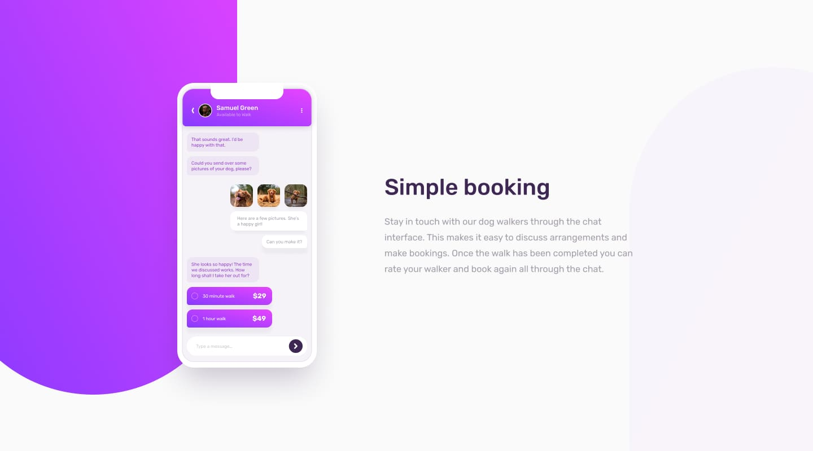

# Frontend Mentor - Chat app CSS illustration solution

This is a solution to the [Chat app CSS illustration challenge on Frontend Mentor](https://www.frontendmentor.io/challenges/chat-app-css-illustration-O5auMkFqY). Frontend Mentor challenges help you improve your coding skills by building realistic projects. 

## Table of contents

- [Overview](#overview)
  - [The challenge](#the-challenge)
  - [Screenshot](#screenshot)
  - [Links](#links)
- [My process](#my-process)
  - [Built with](#built-with)
  - [What I learned](#what-i-learned)
  - [Continued development](#continued-development)
  - [Useful resources](#useful-resources)
- [Author](#author)

## Overview

### The challenge

Users should be able to:

- View the optimal layout for the component depending on their device's screen size
- **Bonus**: See the chat interface animate on the initial load

### Screenshot



### Links

- Solution URL: [GitHub Repository](https://github.com/Ibad1993/Chat-App)
- Live Site URL: [Live Demo](https://ibad1993.github.io/Chat-App/)

## My process

### Built with

- Semantic HTML5 markup
- CSS custom properties
- Flexbox
- CSS Grid
- Mobile-first workflow
- CSS Animations
- Responsive Design

### What I learned

This project helped me strengthen my CSS skills, particularly in:

- **CSS Grid and Flexbox**: Used both layout systems effectively for responsive design
- **CSS Animations**: Implemented smooth slide-in animations on page load
- **Gradients and Shadows**: Created realistic phone mockup with gradients and box-shadows
- **Responsive Design**: Built a mobile-first approach that works across all device sizes
- **CSS Custom Properties**: Used CSS variables for consistent theming

Key code highlights:

```css
/* Beautiful gradient background */
.background-gradient {
  background: linear-gradient(135deg, hsl(293, 100%, 63%) 0%, hsl(264, 100%, 61%) 100%);
  clip-path: polygon(0 0, 100% 0, 100% 85%, 0 100%);
}

/* Smooth animations */
@keyframes slideIn {
  from {
    opacity: 0;
    transform: translateY(30px);
  }
  to {
    opacity: 1;
    transform: translateY(0);
  }
}
```

### Continued development

I plan to continue improving my skills in:

- Advanced CSS animations and transitions
- CSS preprocessors like SASS/SCSS
- JavaScript interactivity for chat functionality
- Performance optimization techniques
- Accessibility best practices

### Useful resources

- [CSS Grid Guide](https://css-tricks.com/snippets/css/complete-guide-grid/) - Excellent resource for understanding CSS Grid
- [Flexbox Froggy](https://flexboxfroggy.com/) - Fun way to learn Flexbox
- [CSS Gradient Generator](https://cssgradient.io/) - Helpful for creating beautiful gradients
- [Frontend Mentor](https://www.frontendmentor.io/) - Great platform for practicing frontend skills

## Author

- Frontend Mentor - [@Ibad1993](https://www.frontendmentor.io/profile/Ibad1993)
- GitHub - [@Ibad1993](https://github.com/Ibad1993)

---

**Note**: Your project is now live on GitHub Pages! 🚀
